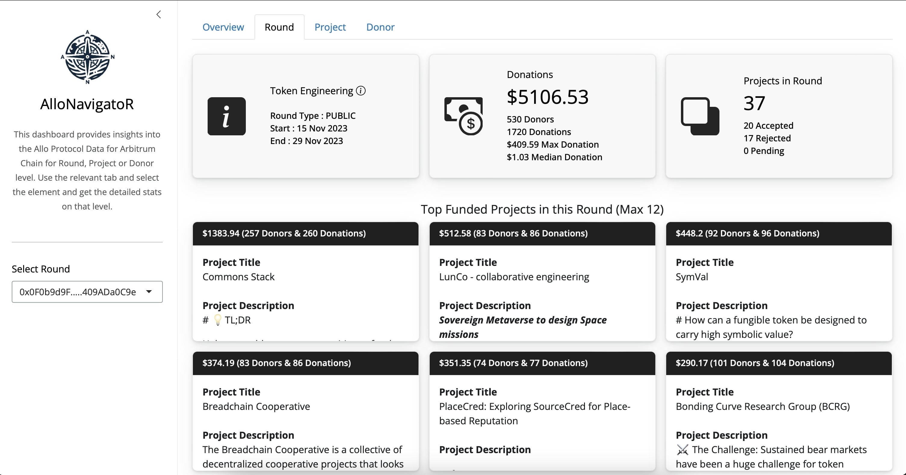

# AlloNavigatoR
AlloNavigatoR is a small, lightweight, but awesome tool developed to visualise Allo Protocol Data in R+Shiny. Built on top of our other, soon to be award winning hackathon submission AlloDataR, this app checks all of the boxes.  It has insightful, easy to understand statistics on round funding, tracks project donations and has information on individual contributions.  It is a complete, open source solution that is ready for deployment so that grant program managers can make more informed data driven decisions.

## [App Walkthrough on YouTube](https://www.youtube.com/watch?v=8d8SEt) <<< Click Here

## [App deployed on a tiny droplet](http://143.198.107.189:4539) <<< Click Here

<hr>

### Walkthrough

#### 1. Open R and install the requirements using

```
install.packages("shiny")
install.packages("shinyjs")
install.packages("bslib")
install.packages("bsicons")
install.packages("readr")
install.packages("lubridate")
install.packages("shinyWidgets")
devtools::install_github("OmniacsDAO/alloDataR")
```
#### 2. Clone this repo and set the R path to the repo.

```
setwd("~/Desktop/AlloNavigatoR)
```

#### 3. Download the fresh Allo Protocol Data

```
Rscript collectData.R
```

#### 4. Run the Shiny Dashboard

```
library(shiny)
runApp()
```

#### Dashboard Features

1. Overview
    * Donation Stats
    * Top Donors
    * Top Funded Projects
    * Top Funded Rounds
2. Round
    * Round Characteristics
    *	Donation Stats
    *	Top Funded Projects in this Round
3. Project
    *	Donation Stats
    *	Round Stats
    *	Top Rounds Participated In
4. Donor
    *	Donation Stats
    *	Participation Stats
    *	Top Projects Donated To


<div align="center">Dashboard</div>